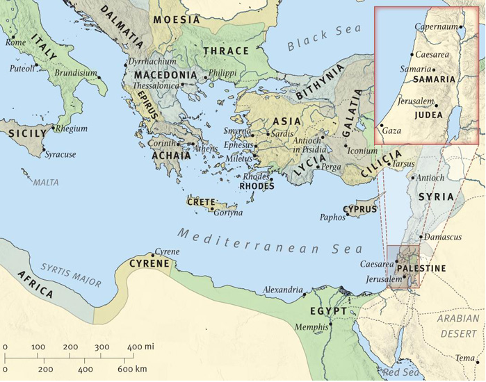

# Acts

- https://www.biblegateway.com/passage/?search=Acts+1&version=ESV
- https://www.esv.org/acts
- https://www.bibleref.com/Acts

## Overview
### Outline
#### Background:
  - The author is Luke, a non-Jewish doctor
  - Written before Paul's death, Mid-60 AD
  - Luke traveled with Paul
  - Written for Theophilus (thee.aw.p.lus)

#### Purpose:
  - Captures the first 30 years of the church (Jesus's ascension in 33 AD to Paul's 1st imprisonment in Rome in 62 AD)

#### Chapters (28):
  - `1-7` Ascension, Holy Spirit, Signs and Wonders, New Believers, Stephen death
     - message spreading in Jerusalem
  - `8-12` Conversion of Paul, Peter healings, Acceptance of Gentiles, Peter freed from prison
     - message spreading in regions of Judea and Samaria full of non-Jewish people
  - `13-20` Paul's 3 missionary trips, the Jerusalem Council (`15`)
     - message now spreading out to the nations
  - `21-28` Paul's arrest and trip to Rome
     - was in prison for 5 years, 2 of those years in Rome

### EVS Introduction
https://www.esv.org/resources/esv-global-study-bible/introduction-to-acts

- Purpose is to give an "orderly" account of the "early" church after the resurrection
- Traveled with Paul
- Only non-Jewish writer of the NT
- Ends with Paul's 1st Roman imprisonment, awaiting trial before Caesar ~ 62 AD
- Date of the book is before Paul's death in the mid-AD 60s
- Does not cover Paul's defense, release, and further preaching

### BibleProject Guide
https://bibleproject.com/guides/book-of-acts

#### 1: Jesus Commissions His Disciples and Ascends to Heaven
- Begins with the risen King Jesus instructing the disciples about life in his Kingdom.
- The Spirit will empower his disciples to be witnesses throughout the world
- Jesus is taken up from their sight in a cloud

#### 2-7: Pentecost in Jerusalem and the Birth of the Church
- Followers wait in the city for Pentecost, receive the Holy Spirit, and begin speaking in other tongues
- The new temple spoken of by the prophets is Jesus's new convent family
- This new temple is generous, donating property and possessions to a common fund to help the poor (how it was originally supposed to be)
- There is hostility between the old temple and the new temple
- Stephen gives a long speech, showing how Israel's leaders have rejected the messengers God sent, including Jesus and the disciples
- The Jerusalem leaders become enraged and murder Stephen, launching a wave of persecution
- This persecution resulted in his followers spreading out into Judea and Samaria

#### 8-12: The Jesus Community Becomes an International Movement
- The church becomes a multiethnic, international movement
- Philip's mission into Samaria
- Paul is converted
- Peter has a dream vision. Led to a house of a Roman soldier, full of non-Jews. All respond to the gospel
- A church at Antioch is established
- First called Christians at Antioch
- Missionaries are sent out

#### 13-20: Mission to Israel and Clashes with Roman Culture
- Paul and coworkers travel around the Roman empire to announce the good news
- The first journey starts in the interior of Asia Minor (Turkey). Ends with an important meeting (Jerusalem Council)
- The second journey is through Asia Minor and ancient Greece
- The third trip through the same territory once again, ending back in Jerusalem
- The main theme is Paul visits the Jewish synagogue, and shares how Jesus is risen, now forming a new multiethnic people of God
- Some believe, others oppose
- The next theme is a clash of cultures between Christians and the Greek and Roman world

#### 21-28: Paul Arrested in Jerusalem and Imprisoned in Rome
- Paul is attacked by Jewish people who think he has betrayed Israel, attracting the attention of Roman soldiers
- Some soldiers think he is a terrorist from Egypt
- Paul was put on trial before the Sanhedrin and Roman leaders in Caesarea
- Governor Felix waits for the next governor, Fetus, who brings King Agrippa to examine Paul
- Paul transferred to Rome, experiencing a near-death voyage across the Mediterranean
- This time in prison Paul writes - Ephesians, Philippians, Colossians, and Philemon

### Purpose

- Captures the apostle's activities leading people to faith, locally, regionally, and throughout the Roman empire.

### Chapters (28)

#### 1-7: Ascension, Holy Spirit, Signs and Wonders, New Believers, Stephen death

- `1` Witnesses ... to the ends of the earth, ascension of Jesus
- `2` They are filled with the Holy Spirit
- `3` Heals a lame man, tells the crowd to repent
- `4` Preach with authority, share everything in common
- `5` Signs and Wonders, preach that the Christ is Jesus
- `6` Accuse Stephen of false charges
- `7` Stephen presents the history of Israel, is stoned to death

#### 8-12: Conversion of Paul, Peter healings, Acceptance of Gentiles, Peter freed from prison

- `8` Philip preaches to the Samaritans, Simon the Magician believes, Philip and the Eunuch
- `9` Conversion of Saul, Peter performs many healings
- `10` Cornelius and Peter, the gospel now spreads to Gentiles and they also receive the Holy Spirit
- `11` Acceptance of Gentile believers, Paul begins his work
- `12` Persecution, Angle frees Peter from prison, Herod struck down by an Angle

#### 13-20: Paul's 3 missionary trips, the Jesusalem Council

- `13` 1st missionary trip, Paul and Barnabas set apart, Speaking in the Synagogue, Focus on Gentiles going forward
- `14` 1st missionary trip continues, Paul and Barnabas preaching, Locals think they are gods, Paul stoned, continue preaching
- `15` The Jerusalem Council
- `16` 2nd missionary trip, Timothy joins Paul, Expels a demon from a girl and then gets thrown in Prison, Jailer converts
- `17` 2nd missionary trip continues - Thessalonica, Berea, Athens
- `18` 2nd missionary trip continues - goes to Corinth, Apollos becomes a powerful preacher
- `19` 3rd Missionary trip, lots of miracles, a disturbance from a silversmith
- `20` 3rd missinary trip continues, traveling while facing hardship

#### 21-28: Paul's arrest and trip to Rome

- `21` Paul goes to Jerusalem, Visits James, Riot breaks out, Arrested
- `22` Paul retells his story, tells the crowd sent to the Gentiles, they want to kill him
- `23` Plot to kill Paul, sent at night to the safety of Governor Felix
- `24` Paul's trial before Governor Felix in Caesarea, left in prison for 2 years
- `25` Paul before new Governor Festus, Paul requests to appeal to Cesear
- `26` Paul tells his story to King Agrippa
- `27` Paul sails for Rome and is shipwrecked
- `28` Paul in Malta for 3 months, Paul in Rome under house arrest

### Difficulties
None

### Observations

- The Holy Spirit's arrival empowered the group to spread the message of Christ dying for their sins.
- Because of persecution, the gospel spread through the region and beyond.
- Things did not always go smoothly. Paul is performing miracles, people are converting and then he is stoned and left for dead.
- Jews would always get very upset when it was stated that the Gentiles were included.
- There is confusion over accepting Gentiles and if so what are their requirements? They define these requirements - no idols, sexual immorality, etc.
- There were disputes among the Christian leaders. Paul and Barnabas parted ways over bringing Mark or not.
- Many miracles were performed. For example, when Paul was shipwrecked on an Island he was bitten by a snake and nothing happened. Next, the people of the Island bring their sick and are healed. Peter prays for a Lady who has died, she is brought back to life.
- Paul would always argue that Jesus fulfilled the Old Testament.

---

## Chapters (28)

### Ch 1
> Witnesses ... to the ends of the earth, ascension of Jesus

- Jesus appeared to his followers for **40 days** `1:3`
- Ask if "now" Jesus will restore Israel's independence `1.6`
- Will receive the Holy Spirit. **“..witnesses .. to the ends of the earth”** `1:8`
- As they were looking on ... **a cloud took him out of their sight**. `1:9`
- There were about **120** in the group
- The followers prayed for who to choose to fulfill Judas' role. Cast lots and picked Matthias.

Notes:
- https://www.bibleref.com/Acts/1/Acts-chapter-1.html
- Casting of lots is the last act of a fully Jewish group
- The Holy Spirit comes and the church is formed

### Ch 2

> They are filled with the Holy Spirit

- On the day of Pentecost, the Holy Spirit came ... they were filled and spoke in other tongues (languages from the surrounding communities). They had not learned these languages.`2:3`
- Peter speaking to the crowd told them
    - through the prophet Joel: `2:17` (*Joel 2:28-32*)
       - in the last days will pour out His Spirit
    - God has made “this Jesus, whom you crucified, both Lord and Christ”
    - “Repent and be baptized”.`2:37`
    - **3k** became believers that day `2:41`
- Devoted themselves to the apostles' teaching `2:42`
- The apostles did many miracles. `2:43`
- They all sold their possessions to share among the needy. `2:46`

### Ch 3

> Heals a lame man, tells the crowd to repent

- Peter heals a crippled beggar `3:6` ... and they (crowd) were filled with wonder and amazement `3:10`
- Peter tells onlookers that they killed the “author of life, but God raised him from the dead” `3:16`
- **"Repent therefore, and turn back, that your sins may be blotted out"** `3:20`

Notes:
 - Repentance is required to follow Jesus

### Ch 4

> Preach with authority, share everything in common

- Were put in jail, questioned the next day
- **Peter** and **John** preaching ... ~ **5k** people become believers `4:4`
- Peter declares “Salvation is found in no one else” `4:12`
- Were astonished at how Peter/John spoke ... both unschooled `4:13`
- The Jews wanted them to stop but did not know what to do, all of the people were praising God for the miracle (crippled beggar)
- All the believers were one in heart and mind ... they had everything in common `4:33`
  - There was not a needy person among them `4:34`

Notes:
- First time persecuted, put in jail overnight
- Peter and John are uneducated, but are preaching with great authority

### Ch 5

> Signs and Wonders, preach that the Christ is Jesus

- Ananias and Sapphira sell their property but only give a partial amount, acting like it was the whole amount. Confronted as lying, both fall dead. `5:1-7`
- The apostles performed many miraculous signs and wonders among the people
- Apostles were jailed again ... but an angel of the Lord freed them
- The Jewish leaders questioned them again, were furious, and wanted to put them to death. “... and you intent to bring this man's blood upon us”. `5:28`
- A Pharisee named Gamaliel told them (Sadducees) to leave them alone. If this is from man it will die out. "but if from God, you will not be able to overthrow them. You might even be found opposing God!" `5:39`.
  - they took his advice
- The Apostles rejoice when being persecuted ... counted as worthy to suffer
- Every day, in the temple and from house to house, they did not cease teaching and preaching that the **Christ is Jesus** `5:42`

Notes:
- https://www.bibleref.com/Acts/5/Acts-chapter-5.html
- Grave consequences for lying to God
- They continue to preach despite being put in jail
- There are many healing
- The disciples before wanted power (i.e.Messiah), now they are more than willing to suffer for the good news

### Ch 6
> Accuse Stephen of false charges

- Some initial complaints from the Hellenist Jews about the distribution of food. The apostles chose 7 men to take over these types of responsibilities.`6:1-3`
- The number of disciples increased and many priests became believers `6:7`
- **Stephen** was speaking & performing miracles. They brought up false charges against him ... “change the customs of Moses” `6:11`

Notes:
- https://www.bibleref.com/Acts/6/Acts-chapter-6.html
- Hellenist Jews spoke Greek vs Aramaic and typically were not from Jerusalem.
- Stephen is great at debating

### Ch 7

> Stephens presents the history of Israel, is stoned to death

- Stephens presents the history of Abraham through Moses, Joshua, David, and Solomon
- Tells the Jewish leaders they are “stiff-necked people, with uncircumcised hearts and ears!”. `7:51`
Was there a prophet your fathers did not persecute? And now murdered the righteous one.
- The Jews stoned Stephen .. Saul was looking on `7:58`
- Stephen becomes the first martyr `7:60`

Notes:
- https://www.bibleref.com/Acts/7/Acts-chapter-7.html
- In the very beginning the disciples were tolerated by the Sandedrin/Priests
- Stephen was accused in Ch 6 of "changing the customs of Moses"

---

### Ch 8

> Philip preaches to the Samaritans, Simon the Magician believes, Philip and the Eunuch

- Saul approved of his execution (Stephen). The church was now being persecuted  ... was scattered. `8:1`
- Those who were scattered preached wherever they were at `8:4`
- The crowd paid attention to Philip ... many miracles `8:5-8`
- Simon a local magician wanted the same power as the apostles but was rebuked by Peter
- Philip explains the “Good News” to an Ethiopian. Was reading [Isaiah 53](http://www.biblegateway.com/passage/?search=Isa%2053) (Suffering Servant).
- Philip told him the good news about Jesus.`8:35`
- The eunuch was baptized. `8:38`

Notes:
- https://www.bibleref.com/Acts/8/Acts-chapter-8.html
- Philip preaches and heals
- Samaritans - hybrid people, descended from Israelites of the northern kingdom and Assyrians while exiled
  - They receive the good news
  - Receive the Holy Spirit when the apostles pray for them
- A sorcerer (Simon) believes and wants the same power, and gets rebuked by Peter
- Philip teaches an Ethiopian official, who believes and gets baptized

### Ch 9
> Conversion of Saul, Peter performs many healings

- A light from heaven flashed around Paul .. **“Saul, Saul, why do you persecute me?”** `9:5`
- "Who are you, Lord?" And he said, "I am Jesus, who you are persecuting." `9:6`
- Was blind for 3 days `9:9`
- Ananias was told in a vision to place his hands on Saul to restore his sight. He stated his concerns about Saul ... putting believers in prison.
   - **Paul was chosen to carry Christ's name to the Gentiles** `9:15`
   - "... he must suffer for the sake of my name" `9:16`
   - Once his sight was restored he was **baptized**. `9:18`
- Begin immediately preaching that Jesus was the Son of God.`9:20`
- The Jews conspired to kill Saul. His disciples lowered Saul at night in a basket to escape. `9:25`
- The disciples were **afraid of Paul**, but Barnabas took him and brought him before the apostles. `9:26-27`
- Paul is sent off to Tarsus `9:30`
- The church in Judea, Galilee, and Samaria had peace and multiplied. `9:31`
- Peter performed **healings**:
  - a man named Aeneas, bedridden for 8 years `9:32-35`
  - prayed for a Lady who had died ... she was healed and got up `9:36-41`
  - It became known throughout all Joppa and many believed in the Lord. `9:42`

Notes:
- https://www.bibleref.com/Acts/9/Acts-chapter-9.html
- The followers of Jesus have spread to *Judea*, *Samaria*, and as far as *Syrian Antioch*. Saul has been permitted to pursue them.
- Paul starts in *Damascus* and then escapes and goes to *Jerusalem*. Then again threatened by the Hellenists, was taken to *Caesarea* and sent off to *Tarsus*.
- The church has a period of peace and growth once Paul is sent to Tarsus.
- Vision - a prophetic experience while the person is awake. Different from a dream.

### Ch 10
> Cornelius and Peter, the gospel now spreads to Gentiles and they also receive the Holy Spirit

- Cornelius a non-jew, but a righteousness man is told in a vision to go get Peter (Peter shows up in 4 days) `10:1-8`
- **Peter in a vision was told to eat unclean animals** ... but refused.
  - God tells him, **“Do not call anything impure that God has made clean."** `10:15` [*niv*]
- Peter meets with Cornelius (a Gentile) ... which is against Jewish law
- Cornelius falls at his feet to worship Peter. Peter tells him 'I too am a man". `10:25-26`
- Peter states that God does not show favoritism but accepts men from every nation who fear him and do what is right `10:34-35`
- A large gathering of people. Peter addresses them and tells the story of Jesus Christ `10:36-43`
- The Gentiles present received the Holy Spirit ... spoke in tongues. Peter instructs them to get baptized `10:44-48`

Notes:
- https://www.bibleref.com/Acts/10/Acts-chapter-10.html
- https://www.bibleref.com/Acts/10/Acts-10-15.html
  - Peter goes from eating "common" food, to dining with Gentiles
  - Later he forgets that the Gospel is for everyone (Galatians 2:11-14)

### Ch 11
> Acceptance of Gentile believers, Paul begins his work

- Peter was initially criticized by other believers who were Jewish ... but once hearing the story `11:1-16` they realized that *“Then to the Gentiles also God has granted repentance that leads to life”*. `11:18`
- The scattering due to persecution leads to more evangelism
- Saul (Paul) begins his work `11:25-26`

Notes:
- https://www.bibleref.com/Acts/11/Acts-chapter-11.html
- Because of the Jewish history keeping separated from Gentiles was important
- The Holy Spirit fell on the Gentiles, thus Peter and others had to believe Gentiles now belong

### Ch 12

> Persecution, Angle frees Peter from prison, Herod struck down by an Angle

- The execution of Christians by Herod (made the Jews happy).`12:1-2`
   - James, brother of John was **killed**
- Peter was put in prison but an Angle of the Lord freed him.`12:3-11`
- They examine the prison and then Herod orders that the guards be put to death `12:19`
- Herod was struck down by an Angle of the Lord ... being called a god and not acknowledging the real God. `12:20-23`

Notes:
- https://www.bibleref.com/Acts/12/Acts-chapter-12.html
- The last focus on Peter, now Acts switching to Paul
- The only apostle's death (James the brother of John) explicitly recorded in the Scripture
- Peter wants James, Jesus' half-brother and leader of the Jerusalem church, to know about him escaping prison

---

### Ch 13
> 1st missionary trip, Paul and Barnabas set apart, Speaking in the Synagogue, Focus on Gentiles going forward

- While worshiping and fasting told by the Holy Spirit to "Set apart for me Barnabas for the work to which I have called them" `13:2`.
  - Lay hands and sent them off.
- Speak to a Roman proconsul who was influenced by a Jewish magician. Paul blinds the magician, for some time, and the proconsul believes. `13:4-12`
- Paul speaks in a synagogue teaching about Christ with Jewish history (i.e. Egypt, etc.). `13:16-41`
  - "Therefore, my brothers, I want you to know that through Jesus the forgiveness of sins is proclaimed to you. Through him everyone who believes is justified from everything you could not be justified from the law of Moses." `13:38-39`
- Ask to teach again next week, nearly everyone comes. The Jews are upset, contradicting what Paul said.
- The Jews do all kinds of things to oppose them. Barnabas states that they will focus on the gentiles going forward. `13:46`

Notes:
- https://www.bibleref.com/Acts/13/Acts-chapter-13.html
- This is the `1st` part of Paul’s **first missionary trip**
- Using https://www.knowingthebible.net/bible-maps for maps of Paul's trips

### Ch 14
> 1st missionary trip continues, Paul and Barnabas preaching, Locals think they are gods, Paul stoned, continue preaching

- Paul and Barnabas spoke boldly ... many Jews and Gentiles believed. They performed many miracles. `14:3`
  - But the city was divided, some sided with the Jews, and some with the apostles
  - There were strong forces against them ... including Gentiles. Wanted to stone them `14:5`. They fled to another area and continued preaching.
- At Lystra, a man was healed. They wanted to worship Paul and Barnabas, calling them gods. They tore their shirts asking why they were doing this. `14:8-18`.
- The Jews from the previous town came and convinced the people to stone Paul. They thought he was dead. `14:19`
- They continue to preach.

Notes:
- https://www.esv.org/resources/esv-global-study-bible/map-44-07/
- https://www.bibleref.com/Acts/14/Acts-chapter-14.html
- This is the `2nd` part of Paul’s **first missionary trip**

### Ch 15
> The Jerusalem Council

- There were members from Judea teaching that "Unless circumcised you cannot be saved". There was a dispute so Paul and Barnabas were appointed to go to Jerusalem to see the apostles and elders about this question. `15:1-2`
- Some of the believers, who belonged to the party of the Pharisees, stated that Gentiles must be circumcised. `15:5`
- Peter stated **"But we believe that we will be saved through the grace of the Lord Jesus, just as they will."**. `15:11`
- James (half-brother of Jesus) states that "not trouble those of the Gentiles who turn to God" `15:20`, but instructed them to refrain from “idolatrous” acts that especially repulsed the Jews (idols, sexual immorality, meat of strangled animals, eating blood). `15:21`
- Write a letter stating only these requirements `15:22-29`
- A dispute about taking Mark. Paul and Silas (whom Paul had circumcised) traveled together, while Barnabas and Mark were together. `15:37-41`

Notes:
- https://www.bibleref.com/Acts/15/Acts-chapter-15.html
- Only Paul's activities are convered in the following chapters (No Peter and any other apostle)

### Ch 16

> 2nd missionary trip, Timothy joins Paul, Expels a demon from a girl and then gets thrown in Prison, Jailer converts

- Takes Timothy to accompany him, also circumcised him because of the Jews `16:3`
- Went to Macedonia to preach the gospel `16:10`
- Paul rebukes a spirit out of a slave girl who predicted the future. Her owners had them thrown into jail. "These men are Jews, and they are disturbing our city". `16-24`
- While in jail an earthquake shook the place and all chains and doors open within the jail. The jailer was going to kill himself but Paul told him they were still there. “What must I do to be saved?”. “Believe in the Lord Jesus Christ...”.  He and his family were baptized. He was filled with joy.`61:25-34`
- Were being let go from prision, but told them they were Roman citizens. They were apologized to. `61:35-40`

Notes:
- https://www.bibleref.com/Acts/16/Acts-chapter-16.html
- **2nd missionary journey** - Paul, Silas, and Timothy
- Luke now joins Paul
- Using https://www.knowingthebible.net/bible-maps for maps of Paul's trips

### Ch 17

> 2nd missionary trip continues - Thessalonica, Berea, Athens

- Paul & Silas preached in a local synagogue (Thessalonica) with success but jealous Jews went after them `17:1-9`
- Goes to Berea, and many received the words from Paul, examining the Scriptures based on what Paul said. But again the Jews went after Paul. Paul now goes to Athens. `17:10-15`
- Paul preached in Athens while waiting for his co-workers. Is brought to a public speaking area where he presents Christ. Some mock, some believe. `17:22-34`

Notes:
- https://www.bibleref.com/Acts/17/Acts-chapter-17.html
- Luke stayed in Philippi
- Some of the Greek philosophers think the concept of the resurrection is crazy

### Ch 18

> 2nd missionary trip continues - goes to Corinth, Apollos becomes a powerful preacher

- Paul leaves Athens and goes to Corinth.
- Stays with Aquila and made tents.
- In Corinth, Paul preached to the Jews .. but again was opposed.  “From now on I will go to the Gentiles”.`18:6`
- In vision is told he will be protected. Stays another 1 and ½ years. `18:9-11`
- Apollos comes to Ephesus and meets Aquila and Priscilla (wife). They explain God more accurately. Apollos becomes a powerful preacher. `18:24-28`

Notes:
- https://www.bibleref.com/Acts/18/Acts-chapter-18.html

### Ch 19

> 3rd Missionary trip, lots of miracles, a disturbance from a silversmith

- Paul prayed for new disciples to receive the Holy Spirit .. they spoke in tongues and prophesied `19:1-7`
- Paul spoke in the synagogue for 3 months and then spoke in other areas of Asia for **2 years** `19:8-10`
- Paul did extraordinary miracles .. handkerchiefs that touched Paul were used to heal others `19:11-12`
- Others tried to use the name of “Jesus” to drive out demons. A man demon possessed gave a person doing this a beating. Then great fear among the people occurred. Many burned publicly their books. `19:13-20`
- A great disturbance in Ephesus caused by Demetrius a silversmith who created shrines/images that Paul stated were not gods.  He and others stirred up the people. A riot almost breaks out. The Christians convince Paul not to address the crowd. The local city clerk convinces the crowd to leave. `19:23-41`

Notes:
 - Commentary on `19:1-6` - https://www.bibleref.com/Acts/19/Acts-19-6.html
 - The city of Ephesus was well known for witchcraft
 - Using https://www.knowingthebible.net/bible-maps for maps of Paul's trips

### Ch 20
> 3rd missinary trip continues,  traveling while facing hardship

- A young man who fell asleep while Paul was talking late into the night fell and died. Paul was able to raise him from the dead. `20:7-12`
- Paul knew that he faced “prison and hardships” everywhere he was going. “...**my only aim is to finish the race and complete the task the Lord Jesus has given me -- the task of testifying to the good news of God's grace**”.`20:24` [niv]
- Remembering the words of the Lord Jesus - "It is more blessed to give than to receive". `20:35`

Notes:
- https://www.bibleref.com/Acts/20/Acts-chapter-20.html

---

### Ch 21
> Paul goes to Jerusalem, Visits James, Riot breaks out, Arrested

- A prophet tells them that Paul will be bound and handed over to the Gentiles. They try to convince him not to go forward. Paul tells them he is willing to go to prison and even die in the name of the Lord Jesus. `21:10-15`
  - got ready and went up to Jerusalem `21:15`
- Paul went through purification rites (shaves head, etc.). There were concerns from other Christian Jews that Paul was teaching that believers do not have to follow the customs of Moses. `21:17-26`
  - Paul went to James, and all the elders were present `21:18`
  - Takes four men under a vow, to purify, pays for their expenses
  - States the letter that had been sent to the Gentiles - abstain from what was sacrificed to idols, blood, strangled, sexual immorality
- The Jews from Asia were in Jerusalem and came after Paul after seeing him in the temple. A riot breaks out. Paul was beaten. Paul was arrested by local officials. The mob charges "Git rid of him!". `21:27-36`
  - Seen Trophimus the Ephesian in the city with Paul and assumed that Paul had brought him into the temple. `21:29`
- Ask to speak to the crowd `21:37-40`

Notes:
- https://www.bibleref.com/Acts/21/Acts-chapter-21.html
- James ask Paul to prove his Jewishness by helping a group of men fulfill their Nazirite vow.
- Spends the next 5 years in custody

### Ch 22
> Paul retells his story, tells the crowd sent to the Gentiles, they want to kill him

- Turns to the crowd to speak ... tells his story of how Jesus spoke to him (a bright light from heaven flashed around him) `22:1-22`
- When he stated that we would be sent to the “**Gentiles**” the crowd became angry again ... wanted to kill him. `22:22`
- Told the local commander that he was a Roman citizen ... they held off flogging him. `22:24-29`
- They take him to the Jewish council (Sanhedrin) the next day. `22:30`

Notes:
- https://www.bibleref.com/Acts/22/Acts-chapter-22.html

### Ch 23
> Plot to kill Paul, sent at night to the safety of Governor Felix

- Ananias (An.a.ni.us) ordered Paul to be struck. `23:1`
- Paul apologizes not knowing he insulted a high priest. `23:5`
- States that "I stand on trial because of the hope of the resurrection of the dead." The Pharisees and Sadducees begin arguing about eternal life ... yes or no. `23:6-8`.
- Men (40+) took an oath not to eat or drink until Paul was killed. `23:12-15`
- Paul's sister's son hears about the plot and reports it to the commander. He then prepares 200 soldiers, 70 horsemen, and 200 spearmen to go to Caesarea at night. Writes a letter to the Governor Flex. `23:16-31`
  - Soldiers took Paul at night to Governor Felix  ... to hear his case
  - The governor agrees to hear the case, once the accusers get there

Notes:
 - https://www.bibleref.com/Acts/23/Acts-chapter-23.html
 - Ends up staying for 2 years in Caesarea, under governor Felix
 - The next governor will be Porcius Festus

### Ch 24
> Paul's trial before Governor Felix in Caesarea, left in prison for 2 years

- Paul is on trial before Felix ... the Jews, including the high priest, accuse Paul of many crimes. `24:1-9`
- Paul defends himself. "It is about the resurrection of the dead that I am on trial". `24:10-21`
- Felix left Paul in prison, with some freedom (could see his friends). `24:22-23`
- Felix was hoping to get bribed by Paul, who sent for him often. After **2 years** Festus succeeds Felix as the governor. Paul is left in prison, by Felix as a favor to the Jews. `24:27`

Notes:
- Paul returns to Jerusalem after his 3rd missionary trip
- After 3 days the Roman army tribune hears of a plot to kill Paul by the Sanhedrin, they send him to Felix the governor in Caesarea
- Is in prision under Felix for 2 years

### Ch 25
> Paul before new Governor Festus, Paul requests to appeal to Cesear

- Festus goes to Jerusalem and the chief priests and others lay out their case against Paul. The Jews want Paul sent to Jerusalem because they have a plan to ambush him to kill. Festus tells them to come to Caesarea to bring their charges. `25:1-5`
- A tribunal happens, where Paul defends himself and requests to appeal to Caesar. Festus agrees to the request. `25:6-12`
- Festus discusses Paul's cases with King Agrippa (who was visiting).  King Agrippa wants to hear Paul himself. `25:13-22`
- Ask King Agripps to examine Paul so Festus would have something to write about Paul concerning his charges. `25:23-27`

Notes:
 - https://www.gotquestions.org/Herod-Agrippa-II.html

### Ch 26
> Paul tells his story to King Agrippa

- Tells King Agrippa his conversion story. Also stated ... the prophets & Moses stated that the Christ would suffer, first rise from the dead, would proclaim light to his people and the Gentiles. `26:1-23`
    - Paul states that he is obedient to his calling - first to Damascus, Jerusalem, Judea, and also to Gentiles.
    - That all should repent and turn to God.
- Festus interrupts and says Paul is crazy. “Your great learning is driving you out of your mind”.`26:24`
- "King Agrippa, do you believe the prophets? I know that you believe". Agrippa said, “In a short time would you persuade me to be a Christian?” `26:27-28`
- Agrippa and Festus decide that Paul has done nothing deserving death/prison ... could be set free but had already appealed to Caesar. `26:30-32`

### Ch 27
> Paul sails for Rome and is shipwrecked

- The crew that Paul on a ship and sets sail. Paul recommends not to go because of storms. `27:9-12`
- They encounter a storm for many days ... throw the cargo overboard. `27:13-20`
- Paul tells the crew that God has spared their lives and no one will die. `27:21-26`
- Now Paul tells them to take some food for strength. "Not a hair is to perish from the head of any of you." They all were encouraged. There were 276 persons on the ship. `27:33-38`
- The ship hits a sandbar.
- The guards were planning to kill all of the prisoners, but the centurion stopped them. He wanted to keep Paul safe.`27:42-43`
- All were brought safely to land. `27:44`

Notes:
- Paul tries to convince the centurion (Julis) to wait for the winter to pass before going on. But the port is not safe, they want to get to another port.
- End up landing on the island of Malta.

### Ch 28
> Paul in Malta for 3 months, Paul in Rome under house arrest

- Land on an island called Malta. The locals welcomed the crew and were very kind. `28:1-2`
- Paul was bitten by a snake with no effect on him ... the Islanders thought he must be a god.`28:3-6`
- Paul healed ... through prayer ... the sick.`28:7-9`
- Stayed on the island for 3 months .. then set sail again. `28:11`
- In Rome was allowed to stay by himself, with a soldier guarding him. `28:16`
- Speaks to the local leaders of the Jews. "Have done nothing against our people or customs". Desire to hear more, had not heard of any bad about Paul from Judea. But the new sect (Christian movement) is spoken against everywhere. `28:17-22`
- Spoke to a larger group for a day., trying to convince them about Jesus both from the Law of Moses and from the Prophets. Some believed and some did not. Quotes [Isaiah 6:9-10](https://www.biblegateway.com/passage/?search=Isaiah%206%3A9-10&version=ESV). `28:26-29`
  - Hear but never understand
  - See but never perceive
- Paul went on to preach in Rome for 2 years .. while under house arrest. Teaching about Christ in all boldness. `28:30-31`

Notes:
- https://www.bibleref.com/Acts/28/Acts-chapter-28.html
- Probably writes - Ephesians, Philippians, Colossians, and Philemon while in Rome
- After 2 years gains his freedom
- Church tradition says he was executed in 67 AD.
- Using https://www.knowingthebible.net/bible-maps for maps of Paul's trips

