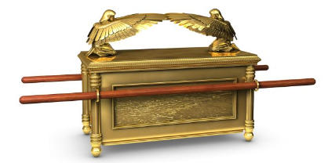

# 1 Chronicles

- https://www.esv.org/1chronicles/
- https://www.biblegateway.com/passage/?search=1chronicles&version=ESV
- [Introduction to 1st and 2nd Chronicles](https://www.esv.org/resources/esv-global-study-bible/introduction-to-1-2-chronicles/)

## Overview

- The religious history of Judah (the southern kingdom), versus the political history found in Samuel and Kings. Focused on the southern kingdom (Judah). Minimal references to Israel and prophets. 
- Priestly point of view; focused on Judah (southern tribe)
- David’s desire and preparation made it possible for Solomon to build the temple
- Covers roughly the same period as Samuel 1 and 2
- Written after the Babylonian captivity. Note the northern tribe went to Assyrian captivity, never to return
- Tradition indicates Ezra wrote Chronicles 

### Bible Project
TBD

### Purpose

- Focuses on the preparation for **building the nation’s Temple**

### Outline (29 chapters)

- Genealogies of David: `1-10`
  - Preparation for the construction of the Temple: `11-22`
  - 11-12: King David
  - 13: Getting the Ark
  - 14: Defeats the Philistines
  - 15-16: The Ark
  - 17: David’s Pray
  - 18-20: Battles
  - 21: David Counts
  - 22: Prepares for building
- Preparation for the operations of the Temple: `23-29`
  - 23: Administration
  - 24: Priests
  - 25: Musicians
  - 26: Gatekeepers, Treasures
  - 27: Army, Managers
  - 27: Plans
  - 29: Gifts

### Difficulties

- Why are “lots” used to determine God’s will (i.e. `24:5`)
- David takes on more wives (Ch 14.)

## Observations

- David put great importance into praising God. Chapter 16 details how the Ark proclaims God’s great name, remembers his acts, declares his glory, etc.
- In Chapter 17 David shows his humility in front of God “Who am I, Lord God, ... that you have brought me this far?”
- Why does David count the men? Is it his pride? He is punished severely for this sin. Over 3 days 70,000 men are killed. 
- David although does not build the temple, does everything to prepare for its construction. 

## Chapters (29)

### Ch 1 
> Genealogy

- Adam to Noah
- Noah sons:
  - Shem, Ham, Japheth
- The Semites (sons of Shem)
  - **Abraham** from this line
- The Hamites
- The Japhethites 
- Abraham
  - **Isaac** and Ishmael
- Descendants of Hagar
- Descendants of Keturah (concubine)
- Descendants of  Sarah
  - Isaac: Esau and **Israel**
- Descendants of Esau

### Ch 2 
> Israel’s Sons

- 12 sons: Reuben, Simeon, Levi, **Judah**, Issachar, Zebulun, Dan, Joseph, Benjamin, Naphtali, Gad and Asher
- Judah to David
- Other families 

### Ch 3 
> David’s Family

- Sons born to David both in Hebron and in Jerusalem
- David reigned in Jerusalem for 36 years
- List the kings of Judah 
- Royal line after the exile 

### Ch 4 
> Judah, Simeon’s family

- Judah descendants 
- Simeon's descendants (son of Israel aka Jacob )

### Ch 5 
> Reuben, Gad’s family

- Reuben’s descendants 
- Gad’s family 
- The half tribe of Manasseh. Became unfaithful. Eventually carried into captivity.  

### Ch 6 
> Levi 

- Levi’s family
- Details about the Levites, responsible for the music in worship
- Aaron's family
- Levite’s locations 

### Ch 7 
> Other families

- Issachar
- Benjamin
- Napthali
- Manasseh
- Ephraim
- Asher

### Ch 8 
> Saul Genealogy

- Benjamin family
- 33 Kish the father of **Saul**

### Ch 9 
> After return from Babylon

- Israel’s genealogies were captured in Kings.
- Judah is taken captive in Babylon because unfaithful
- People in Jerusalem
- Gatekeepers on guard every day (different duties)
- Levites are involved in other matters that enable the service of the sanctuary

### Ch 10 
> Saul Takes His Life

- In battle, Saul takes his own life. 
- His 3 sons also died in battle 
- Israelite army flees,
- The Philistines desecrate the body of Saul. But other men retrieve the bodies, bury them, and fast for 7 days
- Because Saul was unfaithful it resulted in being killed 

### Ch 11 
> King David

- King David is anointed. “In the past, when Saul was king, you led Israel on their military campaigns”. Makes a covenant with them (Israel) before the Lord.
- David becomes great because the Lord is with him `9`
- David’s leadership structure is put in place: Joab; then 3 leaders; others

### Ch 12 
> Forces join David

- Different forces come and join David
- All determined to make David king of Israel
- A great feast 

### Ch 13 
> Getting the Ark

- David arranges to have the Ark returned to the City of David
- They are celebrating 
- While transferring it Uzzah touched it to steady the ark ... he dies, struck down by God
- David became angry 
- They take the ark to the house of Obed-Edom instead; who is thus greatly blessed 

### Ch 14 
> King David defeats the Philistines

- Hiram king of Tyre sends builders for David’s palace
- David takes more wives; more children
- The Philistines hear of David becoming king; search to attach him
- David asks God if he should go against them -- yes. Defeats them and burns their gods.
- Again seeks God concerning the Philistines; again successful
- All the surrounding nations fear David

### Ch 15 
> Ark Brought to Jerusalem

- David prepares (properly this time) to bring the ark to Jerusalem. Will carry using poles on the shoulders of the Levites as Moses had commanded (Uzzah was struck down before).
- There is great praise and dancing
- His wife, Michal (daughter of Saul), sees him dancing and despises him

### Ch 16 
> Praising Before the Ark

- Ark is set inside the tent (tabernacle)

- David sets up people responsible for worship
- Instructs to give praise to the Lord: (also in Psalms 105:1-15, 96:1-13)
  - Proclaim his name
  - Sing to him, tell of all his wonderful acts
  - Remember his acts, covenants
  - Declare his glory
  - Tremble before him
  - Let the heavens rejoice
  - Give thanks to the Lord, for he is good
  - Etc.
- All details of worship organized
- David and the people depart to their homes

### Ch 17 
> God’s Promise to David, David’s Pray

- David was concerned about the ark not being in a tent and only {wanted to build something}
- God tells Nathan the prophet that David’s son will be the temple
- A covenant {short-term Solomon; long-term Jesus through David’s line}
  - Offspring to succeed you, own son, establish his kingdom
  - His kingdom forever
- David prays (humble)
  - “Who am I, Lord God, ... that you have brought me this far?”
  - You have done great things
  - There is no one like you 
  - Do as you promise 
  - You have promised good things to your servant 

### Ch 18 
> David’s war Victories

- David is defeating everyone: Philistines, Moabites, etc.
- He dedicates gold, silver, etc., from these victories to the Lord 
- 14 David reigned over all Israel, doing what was just and right for all his people

### Ch 19 
> David defeats the Ammonites

- King of Ammonite dies. David expresses kindness by sending a delegation to express sorrow.
- They suspect a spy; thus they capture, shave, and send back the envoy
- The Ammonites become obnoxious to David
- The Ammonites hire other armies, but they are defeated
- Others were not willing to help the Ammonites anymore

### Ch 20 
> Battles

- They take over Rabbah, the kingdom is expanded
- More battle wins against the Philistines

### Ch 21 
> David counts the men; builds an Altar

- David, influenced by Satan decides to count all of the men (reason must have been pride)
- Joab's objective is “Why should he bring guilt on Israel?” Was overruled
- Makes the count: over 1 million; did not include Levi and Benjamin
- `7` Evil in the sight of God; so he punished Israel
- A seer was given 3 options for punishment: 
  - 3 years of famine 
  - 3 months of being defeated by your enemies
  - 3 days of the sword of the Lord (paglue}
- Decides on “sword of the Lord”
  - 70k men killed
- David cries out “Was it not I who ordered the fighting men to be counted?”. Asked if he would get the punishment, not the people.
- David is told to build an altar. Requires that he pays for it
- Offers sacrifices, consumed by God
- David would not inquire of God, was afraid of the sword of the angel of the Lord
- Note: Story also told in 2 Samuel 24 

### Ch 22 
> Preparation for the Temple

- David will not build the temple, a man of bloodshed
- But David makes extensive preparations to help his son
- God said he will give Solomon rest from all his enemies 
- David orders all of the leaders in Israel to support Solomon

### Ch 23 
> Adminstration

- David getting old makes Solomon the king
- Organizes the Levites
- Indicates responsibilities they are to perform

### Ch 24 
> Divisions of Priests

- Descendants of Aaron
- Priests are divided into 24 sections
- Duties sorted out by lots

### Ch 25 
> Musicians

- Men set apart for the ministry of prophesying along with music
- All of the trained and skilled in music for the Lord - numbered 288

### Ch 26 
> Gatekeepers, Treasures

- Descendants of Korah and Merari
- Gatekeepers were assigned. Duties for ministering in the temple. 
- Lots were cast.
- Levites were in charge of the treasuries

### Ch 27 
> Army Divisions, Managers

- 12 teams of 24k men take turns guarding each month
- Managers in charge of supplies, produce, etc.

### Ch 28 
> Plans for the Temple

- David summons all of the officials 
- Tells them I wanted to build a temple {ark, worship}
- But I am a man of bloodshed, thus Solomon has been chosen
- Instructs the people and Solomon to “serve him with wholehearted devotion and with a willing mind ...”. “If you seek him will be found”. `9`
- David gives the plans to Solomon

### Ch 29 
> Gifts for building the Temple, David’s pray

- David tells the people how he has given personal wealth to the temple
- Other leaders and officials also gave willingly
- The people rejoice. King David rejoices
- **David’s prayer**:
  - For everything in heaven and earth is yours
  - You are exalted as head over all
  - Wealth and honor come from you 
  - You are the ruler of all things
  - In your hands are strength and power
  - Praise your glorious name
  - Everything comes from your hand
  - You test the heart and are pleased with the integrity
  - Give Solomon the devotion to keeping your commands
- Solomon is made king
- David reigned for 40 years