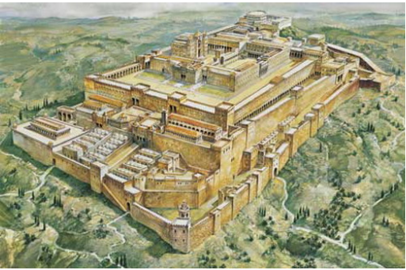

# 1 Kings

- https://www.esv.org/1kings/
- https://www.biblegateway.com/passage/?search=1kings&version=ESV
- [Introduction to 1st and 2nd Kings](https://www.esv.org/resources/esv-global-study-bible/introduction-to-1-2-kings/)

## Overview

- History from Solomon to the Babylonian exile. Note that Samuel (1&2) and Kings (1&2) provide a history of the kings from Solomon to the exile. 
- The author may be Jeremiah, but unknown.
- Used a variety of sources to compile the book
- Divided kingdom: Israel (Northern) 10 tribes, and Judah (Southern) centered in Jerusalem 
  - After Solomon’s death; his son Rehoboam makes bad decisions that divide the kingdom
  - Jeroboam is an Official rebel and takes over 10 tribes 

### Bible Project
TBD

### Purpose

- History of the Kings; capturing their moral lapses and consequences 

### Outline (22 chapters)

- 1-11 United Kingdom under Solomon 
  - Lots of success in everything
  - Builds the temple and his palace
  - His wives bring him down. 11:4 ... was not fully devoted to the LORD his GOD, as the heart of David his father had been
- 12-22 The divided kingdom (kings)

    Israel (Northern tribes) | Judah (Southern tribe)
    -------------------------| ---------------------
    Jeroboam (official)      | 	Rehoboam (son)
    Nadab (son)              | 	Abijah (son)
    Baasha (killed Nadab, all of Jeroboam family line) | Asa (son, did well)
    Elah (son)               | Jehoshaphat (son, did well)
    Zimri (official, kills Elah and the entire family). 7 days only. | 
    Omri (army commander) | 
    Ahab (son) - 22 years; prophet Elijah | 
    Ahaziah (son) | 

#### Highlights

- Solomon’s brother 1st time to become king, then makes a request for a wife who served David. This is a threat, he is executed. 
- God tells Solomon to “ask for whatever you want” -- A discerning heart
- Has great success; builds the temple (7 years); builds his palace (13 years)
- The LORD appears to him a 2nd time .. follow my decrees or face disaster
- Solomon has many wives; begins following their gods (11:4 .. not fully devoted to the LORD his GOD)
- Israel and Judah split. Solomon's son Rehoboam does not listen to advice and is harsh on the people. Leads to a rebellion. 
- Jeroboam (king of Israel) is afraid people who worship will lead them back to Rehoboam. Sets up idols to replace God.
- Warfare between Israel and Judah 
- Elijah the prophet tells king Ahab (Israel) no rain; God takes care of Elijah (stays with a widow)
- Elijah performs miracles; has false prophets executed; rain is coming
- Ahab wins a war. Takes a vineyard. Is told by Elijah “disaster..”. But he humbles himself and is spared. 

### Difficulties

- How does God communicate with the Prophets?

## Observations

- Solomon starts out seeking God. Tells the people `8:58` *“may he turn our hearts to him, to walk in obedience and keep the commands...”*. Is blessed by God, but eventually falls away from God. 11:4 “not fully devoted” like his father David
- Next, it seems all of the kings are bad. They all do evil. Israel is one bad king after another. Fully family lines are destroyed in Israel. 
- Judah keeps the line clean, and 2 of the kings “do good”. Asa, the grandson of Solomon, is a good king -- fully committed to the LORD. His son becomes king and is also a good king.

## Chapters (22)

### Ch 1
> Adonijah tries to become king

- Adonijah (one of David’s sons) sets himself up to be king
- But did not invite the prophet Nathan during a sacrify 
- Nathan goes to Solomon’s mother (Bathsheba) and warns her ... go to the King
- David takes an oath to make Solomon the king
- Adonijah and others hear horns during the feast ... “what is going on?”
- Now Adonijah is afraid for his life .. “King Solomon swear to me ... not put to death”
- Solomon if he (Adonijah) shows himself worthy, no evil, will live

### Ch 2
> David dies, Solomon becomes King

- David is about to die. Tells Solomon to “walk in obedience ...”.
- Tells him about prior enemies, and what he should do (“You are a man of wisdom; you will know what to do”).
- Adonijah asks for a wife by asking Bathsheba to ask the king. The wife previously served David but with no sexual relationship. {trying to get his power back}. 
- When Bathsheba makes the request, Solomon declares that Adonijah will be “struck down today”.
- Joab was also killed. David told Solomon to revenge on him. 

### Ch 3
> Solomon asks for Wisdom

- Solomon made an alliance with Pharaoh king of Egypt and married his daughter.
- Solomon showed his love for the Lord by following his father’s instructions. 
- The Lord appears to Solomon .. “Ask for whatever you want”. **Wants a discerning heart.**
- Was told he would get wisdom, wealth, and long life if he walks in obedience. 
- Rules on the two mothers both claiming a baby. “Cut in two”. 

### Ch 4
> Going well, great wisdom

- Solomon sets up his organization 
- The people were numerous, were happy
- Had lots of provisions ... horses, wealth, etc.
- Had great wisdom; everyone comes to listen to him

### Ch 5
> Preparing to build the Temple

- Hiram, King of Tyre, makes a contract with Solomon to provide material to build the temple in exchange for food.
- They form a good working organization
- Thousands of men work in the temple

### Ch 6-7
> Solomon Builds the Temple and his Palace

- The temple is built 
- 12-13 follow my decrees, observe my laws... I will live among the Israelites
- 7 years to build

- Takes 13 years to build his Palace
 

### Ch 8 
> Temple dedicated, Prays, etc.

- Bring the ark, containing two tablets containing the 10 commandments, into the Most Holy Place of the temple
- A cloud fills the temple
- Solomon acknowledges God’s faithfulness to David and himself
- Solomon delivered prayers and supplications to the Lord
  - You have kept your promises
  - Hear the cry and prayer. And when you hear, forgive
  - No rain, famine, etc. Forgive and act
  - `46` When they sin against you - for there is no one who does not sin. If they repent and turn back to you; forgive their offenses 
- Next Solomon blesses the people of Israel 
  - `58` “May he turn our hearts to him, to walk in obedience to him and keep the commands, decrees, and laws”
  - `60` ... all the peoples of the earth may know that the Lord is God and that there is no other 
- Dedicates the temple, offers sacrifices (22k cattle, sheep, goats)
- `66` ... went home, joyful and glad in heart for all the good things the Lord had done

### Ch 9 
> LORD appears to Solomon

- LORD appears to Solomon (2nd time). 
- Promises and warns Solomon. Follow my decrees or else face disaster
- After 20 years Solomon gives Hiram 20 cities. But Hiram who provided the wood for the 2 buildings was not happy.
- The main laborers are not Israelites, other previous inhabitants. 
- Also builds ships

### Ch 10 
> Queen visits Solomon

- The Queen of Sheba visits Solomon. 
- She is amazed by his wisdom. 
- She gave him gifts 
- 23 Solomon was greater in riches and wisdom than all the other kings of the earth

### Ch 11 
> Solomon’s demise

- Solomon has many wives (300+)
- Begins following their gods
- `v4` ... was not fully devoted to the LORD his GOD, as the heart of David his father had been
- Build high places for these gods
- God tells Solomon He is displeased ... will tear down his kingdom during his son's reign
- God raises up adversaries to Solomon - Hadad, Rezon, and Jeroboam (who will become king)
- Jeroboam (an official, in charge of the whole labor force of the tribes of Joseph)
  - The prophet Ahijah tells him that God will tear down the kingdom and give him 10 tribes.
  - I will give 1 tribe to David’s line
  - `38`  .. do whatever I command you and walk in obedience, .., I will be with you
  - Solomon tries to kill him
- Solomon dies and his **son Rehoboam** succeeds him
- Solomon reigned **40 years**

### Ch 12 
> Splitting into Israel and Judah

- Israel, along with Jeroboam (high official), offers to serve the new king Rehoboam if he lightens their workload
- He asks for advice, the elders say do what the people want
- But he asks a younger man who he grew up with. Told to reject the request and be harsher than his father Solomon.
- Israel rebels; makes Jeroboam king
- `20` Only the tribes of Judah and Benjamin remained loyal to the house of David .. Rehoboam
- `24` They almost go to war with Israel but were told not to be a prophet
- Because Jerusalem and the house of David (line of king David's descendants) are situated in Judah, Jeroboam fears that worshiping will lead the people back to Rehoboam. Thus he builds shrines (idols) in the town of Bethel and Dan. 

### Ch 13 
> The man of God

- A man of God gives a word to Jeroboam. That his son to be born, Josiah will sacrifice the priests on the altar.
- He tries to grab the man, but his hand withers. Ask the man to pray to be restored.
- Ask to come to the king’s home, but refuses
- An old prophet finds the man of God and lies to him to come to his house and eat. Says an angel told him. 
- The man of God agrees. Then later the old prophet tells him 21 “You have defied the word of the Lord ..”
- The man is killed by a lion on his way back
- The old prophet goes and gets his body and buries him.
- Jeroboam is still unrepented, lets anyone become a priest
- This leads to the destruction of Jeroboam and his house. 

### Ch 14 
> Prophecy against Jeroboam, the demise of both kings

- Jeroboam's son is sick and sends his wife to see a prophet. Tells her to wear a disguise. 
  - Ahijah is the same prophet who told Jeroboam that he would get 10 tribes (Israel)
  - All bad news - son will die, and because of their evil ways disaster is coming
  - Jeroboam reigned for **22 years**; his son Nadab succeeded him
- Rehoboam son of Solomon was 41 when became king of Judah. 
  - Reigned for **17 years**; his son Abijah succeeded him
  - `22` Judah did evil in the eyes of the LORD
  - Shishak king of Egypt attacked and stole many treasures from the temple
  - Gold is replaced with bronze
- Continual warfare between Rehoboam and Jeroboam

### Ch 15 
> 2 lines of kings

- Abijah 3 years king of Jerusalem
- His heart is not fully devoted to the LORD
- Continue to fight with Israel - Jeroboam
- `4` Nevertheless, for David’s sake, raises up a son - **Asa** (great-grandson of Solomon)
- Asa resign for **41 years** - did what was <u>right in the eyes</u> of the LORD (v11)
  - expelled the male shrine prostitutes
  - `14` fully committed to the LORD
  - his son Jehoshaphat succeeds him as king
- Nadab the son of Jeroboam becomes king
  - **2 years** over Israel
  - `26` did evil in the eyes of the Lord
  - is killed by Baasha, who becomes the king
- Baasha 
  - kills all of Jeroboam’s family (the LORD was angry with Jeroboam)
  - reigned **24 years**
  - did evil in the sight of the LORD

### Ch 16 
> Kings of Israel - Jeroboam line during Asa time

- The prophet Jehu speaks up against Baasha .. “caused my people Israel to sin .. wipe out Baasha and his house”
- Elah his son becomes the king
  - 2 years king
  - killed by Zimri one of his official 
- Zimri destroys Elah's entire family
  - Only 7 days king
  - Omri an army commander plots against him
  - commits suicide 
- Omri becomes king
  - 12 years as king
  - commits worse sins than other kings
  - his son Ahab succeeds him
- Ahab becomes king
  - 22 years as king
  - Many sins, serve Baal and worship him
  - Set up an altar for Baal

### Ch 17 
> Elijah appears, widow’s son brought back to life

- Elijah tells king Ahab no rain unless he says so
- God tells Elijah to flee ... supplies his food
- God tells Elijah to stay with a widow who will supply him with food
- The jar of flour was not used up `16`
- The widow’s son stops breathing (dies) ... the widow “What do you have against me ...”
- Elijah cries to the LORD and the boy is restored 

### Ch 18 
> The sacrifice between Baal and the LORD

- Told to tell Ahab rain is coming by the LORD
- Obadiah, who serves the LORD meets Elijah, told to tell Ahab he is here
- But Obadiah is afraid, surely will be killed. But Elijah tells it is Ok.
- The king with Elijah - “Is that you, you troubler of Israel?”
- The people are brought in with 400 prophets of Asherah, and 450 prophets of Baal
- `21` “If the LORD is God, follow him; but if Baal is God, follow him”
- Sacrifices are prepared. The idolaters are to call on Baal .. but there is no success. Elijah makes fun of them
- God consumes Elijah’s sacrifice; the Israelites fall down and confess the Lord is God.
- The false prophets are executed
- Tells Ahab rain will come now

### Ch 19 
> Elijah depressed, God speaks to him

- Ahab (king) tells Jezebel what Elijah did. Jezebel sends a message to Elijah “... tomorrow ... life like that of one of them” {killed}
- Elijah was afraid, depressed - “Take my life”
- An angel tells Elijah to eat {helps him}
- God speaks to him {reveals His plan}.  He is to anoint 3 men. There are 7000 in Israel that have not bowed down to Baal.
- Elijah goes to Elisha -- “threw his cloak around him”

### Ch 20 
> The war with Ben-Hadad and king Ahab

- A king attacks Samaria.  Send a message to Ahab king of Israel. Demands the gold, women, and children.
- Then demands stuff from the palace and other houses
- Ahab tells him no for the 2nd demand
- The king decides to attach
- The unnamed prophet tells Ahab that God will give them victory
- Israel inflicts heavy losses on the other king’s army. But is told by the prophet that they will be back. But they will win again
- In this next fight, they destroy the enemy
- The other king (Ben-Hadad) escapes
- Ahab welcomes Ben-Hadad back and makes a treaty. Gets previously taken cities back.
- The prophet tells Ahab he was wrong to not kill Ben-Hadad. This mistake will cost him his life and his people's liberty

### Ch 21 
> King Ahab takes Naboth’s Vineyard

- King Ahab wants a vineyard belonging to Naboth ... “let me have it, will give you a better one”
- Naboth says no
- The king's wife Jezebel decides to get the vineyard
  - Tells elders to bring charges against Naboth
  - Stone him to death
  - Tells Ahab Naboth is dead, go get your vineyard
- Elijah the prophet is told to go to Ahab and tell him the Lord is “going to bring disaster ..”
- Ahab responded by going around in sackcloth meekly. 
- Because he humbled himself the disaster was deferred to the next generation

### Ch 22 
> Micaiah tells king Ahab he will be killed in battle

- Israel (Ahab) and Judah (Jehoshaphat) are considered to have teamed up to war against the Syrians
- `5` Jehoshaphat says let's seek the LORD 1st
- So Ahab brings 400 prophets “Shall I go to war?”  Yes.
- To go and ask for Micaiah. `13` “look the other prophets are predicting success, agree with them”
- `23` “The LORD has decreed disaster for you.”.
- Ahab was killed in battle
- Jehoshaphat King of Judah
  - 25-year reign
  - Did what was right in the eye of the Lord
  - Rid the land of the rest of the male shrine prostitutes 
  - His son Jehoram succeeded him
- Ahaziah King of Israel
  - Son of Ahab
  - 2 years reign 
  - Did evil in the eyes of the LORD
  - Worshiped Baal
