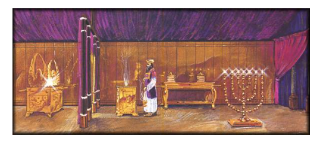
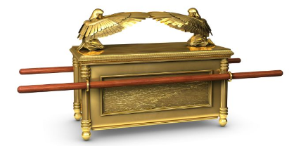

# 2 Chronicles

- https://www.esv.org/2chronicles/
- https://www.biblegateway.com/passage/?search=2chronicles&version=ESV
- [Introduction to 1st and 2nd Chronicles](https://www.esv.org/resources/esv-global-study-bible/introduction-to-1-2-chronicles/)

## Overview

- Written by Ezra the priest
- It Covers Solomon and the kings of Judah 
  - Solomon - `39` years (970 BC - 931 BC)
  - Kings - `~326` years  (931 BD - 605 BC) 
- Initial chapters cover Solomon’s greatness and the temple.
- But when his son Rehoboam takes over the kingdom is divided. Solomon’s main official Jeroboam goes to the new king and asked to “lighten the load of the people”. He asks for advice from, the main officials who agreed with Jeroboam, but does not listen to them. Makes it worse. They split and Jeroboam becomes the king of Israel (10 northern tribes). 
- **Good** kings (did right in the eyes of the Lord)
  - Asa 
  - Jehoshaphat
  - Joash
  - Amaziah (kind of)
  - Uzziah
  - Jonathan
  - Hezekiah
  - Josiah

### Bible Project
TBD

### Purpose

- Shows the history of the Kings of Judah up until the fall of Babylon (~365 years)

### Outline (36 chapters)

- Solomon Worships: `1`
- The Temple: `2-7` 
  - 2 - Prepares for building
  - 3 - Builds the Temple
  - 4 - Furnishings
  - 5 - Ark brought in
  - 6 - Solomon pray
  - 7 - Fire, Sacrifices, and Feast
- Solomon:`8 - 9`
  - 8 - Accomplishments
  - 9 - Queen of Sheba visits 
- Rehoboam: `10-12`
  - 10 - Bad advice, Israel rebels
  - 11 - In Jerusalem
  - 12 - Abandons the law
- Abijah:`13` 
- Asa: `14-16`
  - 14 - Becomes king (good)
  - 15 - Fully committed 
  - 16 - Bad treaty 
- Jehoshaphat: `17-20`
  - 17 - Becomes king (good)
  - 18 - Allied with Ahab, Micaiah prophesies 
  - 19 - Rebuked
  - 20 - Defeats Moab and Ammon
- Jehoram: `21`
- Ahaziah: `22`
- Joash: `23-24`
  - 23 - Plan to make the boy king
  - 24 - Becomes king (good)
- Other kings: `25-28`
  - 25 - Amaziah (good partly)
  - 26 - Uzziah (good)
  - 27 - Jotham (good)
  - 28 - Ahza 
- Hezekiah: `29 - 32` 
  - 29 - Becomes king (good)
  - 30 - Celebrates Passover
  - 31 - Supports worship
  - 32 - Threatened by Assyria
- Manasseh and son Amon: `33`
- Josiah: `34-35`
  - 34 - Becomes king (good)
  - 35 - Celebrates Passover
- Other Kings, the Fall: `36`

### Difficulties

- Angle fighting in a war (32 - “..an angel is sent to cut down all of the Assyrian men”)

## Observations

- Solomon’s asked for wisdom, not great wealth or power. Seeks the right thing and is greatly blessed for it. Places his energy and focus on building a temple for God. Leads the people in worship ... a great pray. Is told that if the people humbled themselves and seek God, He will forgive their sins and heal their land. 
- Although their father as King sought the Lord, sons often go their own evil way. The 1st example is Rehoboam ch. 12 “abandoned the law of the Lord”. But then some of the kings “do what is good in the sight of the Lord”. 
- Special kings: 
  - Jehoshaphat - devoted, removed idols, encouraged the people to follow the Lord
  - Joash - the boy king. Restored temple, took offerings 
  - Uzziah - did right, but was proud
  - Jotham - powerful because he walked with the Lord
  - Hezekiah - Repaired the temple, started sacrifices again 
  - Josiah - Restored temple, revival, celebrated Passover

## Chapters (36)

### Ch 1 
> Solomon Worships, Prays for Wisdom, Given Wealth

- Solomon and others offer a burnt offering 
- God speaks to Solomon “Ask what I shall give you”
  - Ask for wisdom to govern the people
  - Because you did not ask for possessions, etc., wisdom and knowledge are granted
- God also blesses him with great wealth, like no one before or after

### Ch 2 
> Preparing to build the temple

- Solomon assigns men (~150k) to the building project
- Seeks help from Hiram the king of Tyre (who also helped David build his own house)
- States that “even highest heaven cannot contain him” `6`
- Hiram more than willing to help

### Ch 3 
> Builds the temple

- Begins building at Mount Moriah (where the Lord appeared to David, Abraham willing to sacrifice Isaac)
- Details on the sizes, material, etc. 

### Ch 4 
> Temple’s Furnishings

- Hiram made bronze items
- Baths, lamp stands, etc. built
- Solomon takes care of the gold furnishings in the temple

### Ch 5 
> Ark brought to the Temple

- The Ark is brought from the City of David (Zion)
- Put the Ark  of the convent in the inner sanctuary of the house (Most Holy Place)
- The Ark contained the 2 tablets that Moses put there at Horeb
- Trumpeters and singers make themselves heard in unison with praise and thanksgiving
  - “For he is good, for his steadfast love endures forever”
- The glory of the Lord filled the house of God 

The Most Holy Place:

The Ark of the Covenant 

### Ch 6 
> Solomon prays

- Solomon blesses the people
- Tells the people of God’s promise to David. Tells them that he (Solomon) was told to build the temple
- Prays to God in front of everyone
  - No God like you
  - Showing steadfast love
  - Keep for your servant David ... your promise 
  - Heaven .. can not contain you
  - Etc.
- Ask God to hear prayer made from the temple
- Prays for different situations (i.e. no rain, enemies, etc.)
- “O Lord God, do not turn away the face of your anointed one!”

### Ch 7 
> Fire, Sacrifices and Feast, Lord - repentance & warning

- At the end of Solomon’s prayer, fire comes down and consumes the sacrifices 
  - The glory of the Lord filled the temple
  - All the people hit the ground and stated “For he is good, for his steadfast love endures forever”
- Thousands of <u>sacrifices</u>
- After a feast for 7 days, the people are finally sent home joyful and glad
- The <u>Lord appeared</u> to Solomon at night:
  - `14` “If my people who are called by my name humble themselves, and pray and seek my face and turn from their wicked ways, then I will hear from heaven and will forgive their sin and heal their land.” 
  - `19` “But if you turn aside and forsake my statutes and my commandments that I have set before you, and go and serve other gods and worship them, .. I will cast out of my sight”. 

### Ch 8 
> Solomon’s Accomplishments

- Solomon builds out cities
- Makes the non-Israelites workers (slaves), and the Israelites are soldiers, officers, etc.
- Brings Pharaoh’s daughter (pagan) up from the city of David and builds her a different house to live in. Will not live in the house which the Ark is.
- Performs his offerings

### Ch 9 
> Queen of Sheba visits Solomon

- Queen comes with all types of questions
- She is overwhelmed with Solomon's wisdom
- `8` You God “has made you king over them, to maintain justice and righteousness” 
- They exchanged gifts
- Solomon's material wealth, trading might, and military strength are great
- Reigns for 40 years. He dies and his son Rehoboam succeeds him.

### Ch 10 
> Israel Rebels against Rehoboam

- Jeroboam, who was in exile, goes to the king and asks to lighten the load
- Rehoboam consults the elders ... “be kind to them”. But he rejects their advice.
- Goes to a younger person who he grew up with and asks him.  “Make it heavier”
- Israel rebels, except for Judah. Rehoboam flees to Jerusalem.

### Ch 11 
> Rehoboam in Jerusalem

- Judah and Benjamin decide to go to war with Israel. 180k men. But are told not to by Shemaiah the man of God. 
- Rehoboam fortifies his city. 
- The priests and Levites throughout Israel side with Rehoboam
- Has 18 wives, 60 concubines, 28 sons, and 60 daughters
- He moves his sons throughout Judah

### Ch 12 
> Rehoboam abandons the law, consequences

- Rehoboam and Israel abandoned the law of the Lord
- King of Egypt attacks Jerusalem in his 5th year
- A prophet tells them why “You have abandoned me..”
- They humbled themselves;  thus the King only takes treasures from the temple
- Things now go better for Judah
- Ongoing conflict with Jeroboam
- 17 years the king
- His son Abijah becomes king

### Ch 13 
> Abijah King of Judah

- Reigns for 3 years
- With 400k men going to war with Jeroboam, he has 800k men
- Abijah tells the opposing troops of Israel that God is with them because Israel has forsaken God. Judah, he states, is still faithful
- Judah is ambushed, but still defeats Israel - 500k killed
- Later the king of Israel Jeroboam is struck down by God

### Ch 14 
> Asa King of Judah

- Abijah's son Asa becomes king - 10 years of peace
- <u>Did what was good</u> in the eyes of the Lord
- Removed foreign altars and high places, cut down Asherah poles
- Commanded Judah to seek the Lord
- No war, God gave him rest
- They do defeat the Ethiopians 

### Ch 15 
> King Asa fully committed to the Lord

- Asa is told by a prophet to follow and obey God. “Your work will be rewarded”. 
- Asa removed the idols from the land of Judah and Benjamin. He repaired the temple.
- Asa gathers all the people. They sacrifice and make an oath. They sought God eagerly. 
- Removes the grandmother Maakah from her position because made an idol
- **Asa was fully committed to the Lord all his life**

### Ch 16 
> Asa makes a bad treaty

- Makes a treaty with Syria to help with attacks from Israel 
- Is rebuked by a prophet for not relying on the Lord. From now on will be at war.
- Asa is angry and puts the prophet in prison
- Has a foot disease (maybe gangrene), but never relies on the Lord
- Reigns 41 years

### Ch 17 
> Jehoshaphat King

- Son becomes king
- His **heart was devoted to the ways of the Lord**
- Remove the high places and the Asherah poles from Judah
- Sent out teachers of the Law to the people throughout Judah
- The fear of the Lord fell on all the kingdoms, did not go to war with Judah

### Ch 18 
> Jehoshaphat, Micaiah prophesies against Ahab

- <u>Jehoshaphat allied with Ahab</u> through marriage
- Asked to go to war with Ahab. But first seeks the Lord. 
- They ask 400 prophets, all say to go to war. But Jehoshaphat asks for a real prophet. 
- Ahab says has one but never says anything good.
- They get Micaiah, who tells them the king with being killed
- King Jehoshaphat cries out and is spared in battle
- Ahab is killed by an arrow

### Ch 19 
> Jehoshaphat rebuked

- Jehoshaphat is rebuked by a seer for his alliance with Ahab
- Turns the hill country people to the Lord
- Tells his judges to judge justly in the fear of the Lord
- Appoints Levites as officials ... act with courage 

### Ch 20 
> Jehoshaphat defeats Moab and Ammon

- Warned that “a vast army is coming” against them
- Seeks help from the Lord, proclaimed a fast
- Prays out loud for the Lord’s help. Declares his past provinces. The people stood with him. 
- Jahziel speaks a word.  “Do not be afraid.” This is the Lord’s battle. 
- The other army was ambushed and destroyed. Their army did not have to fight at all
- They receive lots of plunder ... 3 days to collect it all
- The king reigned for 25 years

### Ch 21 
> Jehoram becomes King

- The firstborn of Jehoshaphat
- Was **evil**
- Kills his brothers 
- Marries the daughter of Ahab (Israel’s king) 
- Because of the covenant with David, the Lord did not destroy Judah
- The prophet Elijah sends Jehoram a letter
  - You have not followed the ways of your father, grandfather
  - Lead the people to prostitute themselves
  - The Lord will strike you 
  - You will be very ill
- The Philistines attack Judah and take his family except for 1 son - Ahaziah
- Jehoram died because of his disease
- No one honors him
- Reigned for 8 years

### Ch 22 
> Ahaziah becomes King, Athaliah destroys the royal family, except for Joash

- The youngest son (others were taken by the Philistines)
- 22 years old
- 1-year reign
- Did **evil**
- Teams up with Israel’s king Joram 
- Is killed
- The evil mother **Athaliah**, once her son (Ahaziah) is dead determined to destroy the royal family. The one exception is prince **Joash**. He is hidden by the daughter of Jehoram for 6 years. 
- The daughter is the wife of the priest <u>Jehoiada</u>. Also the sister of Athaliah.
- Athaliah rules during this time.

### Ch 23 
> The boy Joash becomes King

- Jehoiada the priest put together a plan to install Joash as king
- The boy is crowd as king. Gives him a copy of God’s law
- Queen Athaliah heard the rejoicing and yells “Treason”. 
- Athaliah is executed
- The temple of Baal is torn down, and the priest of Baal is executed

### Ch 24 
> Joash the King

- Starts at 7 years old; reigns 41 years
- Did what was <u>right</u> concerning the Lord <u>while</u> Jehoiada was the priest
- Restores the temple; collects money people were happy to give to pay for the building
- Died at 130
- After the Jehoiada (priest) dies Joash is influenced by others and abandons his good ways
- Prophets were sent, but still would not listen
- They kill the prophet Zechariah (son of Jehoiada) because of his warnings
- Judah is invaded by Syria.
- Joash is wounded in war and then murdered for revenge for killing Zechariah
- Amaziah his son becomes king

### Ch 25 
> Amaziah the King

- 25 years old
- Reigns 29 years
- Did what was **<u>right</u> concerning the Lord, but <u>not</u> wholeheartedly**
- Revenged the people who killed his father (Joash), but not the children
- Hires fighters from Israel, but is told NOT to do this by a man of God. He discharges them.
- The troops are mad and raid towns in Judah 
- After winning a battle, Amaziah takes the gods from his opponents and worships them.
- A prophet warns the king but threatened if he does not stop talking
- He now challenges Israel (pride). Is defeated and valuables in the temple are taken away

### Ch 26 
> Uzziah the King

- The son of Amaziah at 16 is made the king
- He reigned for 55 years
- Did what was **<u>right</u> in the eye of the Lord**
- Was instructed by Zechariah
- In the first half of his reign, he seeks God. 
- He is productive - builds towers, gets working the fields, irrigates the land, etc.
- Becomes famous and strong, but his **<u>pride</u> leads to his downfall**
- Goes into the temple to burn incense on the altar
- The priests comfort him -- “It is not right for you ...”. He gets mad (rages) at the priest but is suddenly struck with leprosy. They hurry the king out of the temp
- He is banned from the temple and his leprosy for the rest of his life
- His son Jotham is now in charge of the palace and governed the people

### Ch 27 
> Jotham the King

- 25 when he becomes king
- Reigned 16 years
- Did what was **right in the <u>eyes</u> of the Lord**
- Grew powerful because he walked steadfastly before the Lord
- His son Ahaz becomes king

### Ch 28 
> Ahaz the King

- 20 when becomes king
- Reigned 16 years
- Did <u>evil</u>, like the kings of Israel 
- Made idols for worshiping the Baals, and even sacrificed his children in fire
- Because of this evil, he is given crushing defeats by the king of Aram (Syria) and Israel
- Israel takes 200,000 people of Judah as captives and slaves
- But the prophet whose name was Oded told Israel they must not make them slaves. Thus, they gave the captives new clothes, etc, and sent them back
- Judah is invaded by more groups. 
- The more Ahaz is inflicted the more he seeks other gods
- His son Hezekiah takes over as king

### Ch 29 
> Hezekiah the King

- 25 years old when becomes king
- 29 years reign
- Did **<u>right</u>** in the eyes of the Lord 
- Repaired the temple
- Removed all defilement from the sanctuary
- “Our parents were unfaithful ... Therefore the anger of the Lord has fallen on Judah”
- “I intend to make a covenant with the Lord”
- The priests purified the temple
- They sacrificed burnt offerings at the altar. They sang songs of praises and gladness.
- So the service of the temple of the Lord was reestablished
- Hezekiah and all the people rejoice 

### Ch 30 
> Hezekiah celebrates the Passover

- The king decides to celebrate Passover again, which they had not been doing.
- He sends out a letter to all of Israel to join. Some mock him, but many come. 
- In the letter, the king urges repentance and reminds them that God will bless them
- Some people have not been cleansed according to the law. Hezekiah prays to God to forgive, and He does. 
- There are a great celebration ... 7 days, then 7 more days
 
### Ch 31 
> Hezekiah supports worship

- Israelites smash things associated with idols
- Money is raised (tithe) to support the priests and Levites in their duties at the temple
- Hezekiah does what is good and right before the Lord his God. He sought after God wholeheartedly. 
- He also prospered

### Ch 32 
> Hezekiah threatened by Assyria

- Judah is invaded by Sennacherib king of Assyria
- Hezekiah consults leaders and takes action (i.e. stops water supply)
- Tells the people to “be strong and courageous ... there is a greater power with us than him ... with him is only the arm of flesh ... us is the Lord our God...
- Assyria does all he can to frighten the people. “On what are you basing your confidence. ...Where the gods of those nations ever able to deliver their land from my hand?”
- Hezekiah and Isaiah pray to God. An angel is sent to cut down all of the Assyrian men.
- The king of Assyria returns in shame and is murdered
- Hezekiah does have issues with pride

### Ch 33 
> Manasseh the King, Amon the king

- 12 years old; reigned for 55 years
- Did **<u>evil</u>** ... more than the original nations that were destroyed
- Rebuilds altars that his father had destroyed
- Sacrificed his children; practiced witchcraft, etc. 
- Was taken prisoner by Assyria, bound with a hook in his nose
- Prayed earnestly and the Lord thus brought him back
- `13` Then Manasseh <u>knew that the Lord is God.</u>
  - Got rid of the foreign gods
  - Removed images from the temple
  - Restored the altar, sacrifices again
- Amon the son becomes king
  - Does evil
  - Never humbled himself
  - Is assassinated
  - His son Josiah becomes king

### Ch 34 
> Josiah the King - GOOD

- 8 years old when becomes king
- Reigned 31 years
- Did what was **<u>right</u>** in the eyes of the Lord
- In the 8th year of his reign (still young) he begins to “seek the God his father David”
- In his 12th year, he begins to purge idolatry
- Repairs the Temple
- They find the `“Book of the Law”` 
- They read it to Josiah -- he tears his robes.  He states the Lord’s anger is great because of those before him who did not follow all that was written down
- He asks to inquire of the Lord. God confirms through a female prophet that because he has repented and shown remorse the things written will not happen
- He restores real worship. Has everyone pledged themselves to the words of the covenant? 
- As long as he lived, they did not fail to follow the Lord

### Ch 35 
> Josiah celebrates Passover

- Celebrates the Passover
- Provides lambs, goats, and cattle for the people from his possessions
- Others also contributed from their possessions
- No other king had celebrated Passover like this
- Was killed in a battle
- He is greatly mourned 

### Ch 36 
> Follow-on Kings, the Fall

- Josiah’s son <u>Jehoahaz</u> is made king. Is 23, but reigns only 3 months.
- Jehoahaz is dethroned by Egypt and taken away. His brother is made king. 
- The brother's name is changed from Eliakim to <u>Jehoiakim</u>
- Jehoiakim is 25 and reigns for 11 years. 
  - Does evil
  - Taken away by Nebuchadnezzar king of Babylon
  - The king also takes articles from the temple of the Lord
- The son <u>Jehoiachin</u> becomes king
  - 18 years old, reigns 3 months and 10 days
  - Does evil
  - Taken also by Nebuchadnezzar
- The uncle (brother of Jehoiakim) <u>Zedekiah</u> is made king
  - 21 years old
  - 11-year reign
  - Did evil, did not humble himself before the prophet Jeremiah
  - Also rebelled against Nebuchadnezzar
- The Fall of Jerusalem
  - Warned by the prophets .. again and again
  - Was given over to the Babylonians (Nebuchadnezzar)
  - They set fire to the temple, broke the walls of Jerusalem, burned palaces
  - The land enjoyed its sabbath rests .. spoken by Jeremiah
  - The king of Persia will rebuild the temple
