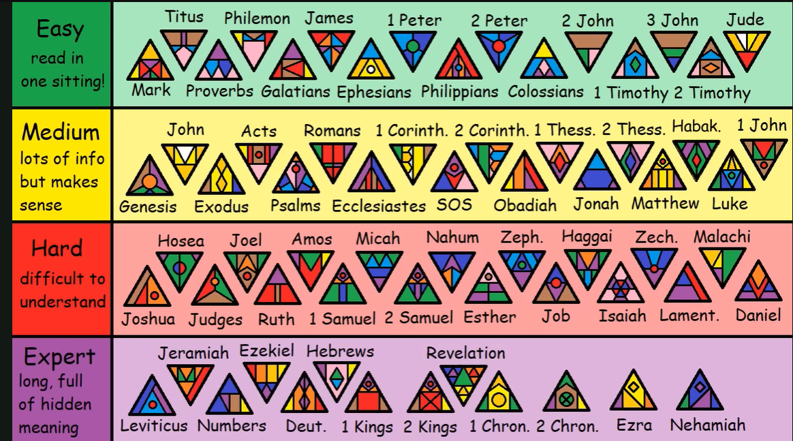

# Overview
TBD.
> The study of the nature of God and religious belief

- https://www.crossway.org/articles/what-is-theology
  - *"Good theology is based in the belief that God exists, is personal, can be known, and has revealed himself. These presuppositions motivate theologians to devote themselves to a passionate pursuit of knowledge from God’s Word."*
  - *"Fully loving God and obeying the Great Commandment requires actively engaging the mind in the pursuit of truth."*
- https://www.gotquestions.org/Christian-theology.html

## Bible Books based on Difficulty

| Difficulty | Books (Top Row) | Books (Bottom Row) |
|---|---|---|
| **Easy** read in one sitting! | Titus, Philemon, James, 1 Peter, 2 Peter, 2 John, 3 John, Jude | Mark, Proverbs, Galatians, Ephesians, Philippians, Colossians, 1 Timothy, 2 Timothy |
| **Medium** lots of info but makes sense | John, Acts, Romans, 1 Corinth., 2 Corinth., 1 Thess., 2 Thess., Habak., 1 John | Genesis, Exodus, Psalms, Ecclesiastes, SOS, Obadiah, Jonah, Matthew, Luke |
| **Hard** difficult to understand | Hosea, Joel, Amos, Micah, Nahum, Zeph., Haggai, Zech., Malachi | Joshua, Judges, Ruth, 1 Samuel, 2 Samuel, Esther, Job, Isaiah, Lament., Daniel |
| **Expert** long, full of hidden meaning | Jeremiah, Ezekiel, Hebrews, Revelation | Leviticus, Numbers, Deut., 1 Kings, 2 Kings, 1 Chron., 2 Chron., Ezra, Nehemiah |

## Questions
Capture theology based questions.

- Why did Christ have to die? Couldn't He just have forgiveness us?
  - Legal payment for sin
  - Is required by a Holy God
  - God is really, really, really **Holy**

## Hell

- `Hell` - [R.C. Sproul - The Problem with Hell](https://www.youtube.com/watch?v=5YzGYRakRes)
- https://www.youtube.com/watch?v=_cnUwbgpNKc - R.C. Sproul
- https://www.gotquestions.org/eternal-damnation.html - offensive
- https://www.gotquestions.org/loving-God-send-someone-hell.html
- `ECT` - Enternal Conscious torment
- `Annihilationism` - ceasing to exists
- https://bibleproject.com/podcast/series/heaven-hell/
- https://timothykeller.com/blog/2008/8/1/the-importance-of-hell
- https://podcast.gospelinlife.com/?s=Hell

## Topics

### Trinity
- https://www.gotquestions.org/Trinity-Bible.html

  > "The doctrine of the Trinity has been a divisive issue throughout the entire history of the Christian church. While the core aspects of the Trinity are clearly presented in God’s Word, some of the side issues are not as explicitly clear. The Father is God, the Son is God, and the Holy Spirit is God—but there is only one God. That is the biblical doctrine of the Trinity. Beyond that, the issues are, to a certain extent, debatable and non-essential."

### Dispensationalism

- Known for its distinctive [eschatology](https://en.wikipedia.org/wiki/Eschatology) (s.ca.tall.la.g) doctrines.
- Originated in the 19th century in the teachings of John Darby. The Scofield's Bible (1909) also contributed with its study notes.
- Up holds the doctrine of the pre-tribulation rapture of the church.
  - Church raptured, taken to heaven before the second coming.
  - Will be a seven-year period of tribulation
  - The second coming is at the end of the tribulation.
  - There will be 1,000 years called the Millennial Kingdom.
- Holds that there are two distinct people of God - **Israel** and the **Church**.

> Note that Reform "covenant" theology holds that there is one people of God.

References:
- https://www.ligonier.org/learn/articles/dispensationalism
- https://www.gotquestions.org/dispensationalism.html

### Other

- [Women Pastors - got questions](https://www.gotquestions.org/women-pastors.html)
- `Progressive Christianity` - TBD
  - https://www.gotquestions.org/progressive-Christianity.html
- `New Apostolic Reformation` (NAR) - A religious *movement* that emphasizes **experience** over **Scripture**, **mysticism** (*altered state of consciousness given religious meanining*) over **doctrine**, and the concerpt of mondern-day **apostles**.
  - https://www.gotquestions.org/New-Apostolic-Reformation.html
  - Apostoloic (*ap.a.stall.lic*)
- The meaning of Genesis 1: 26 ["Let us make man in our image"](https://www.bibleref.com/Genesis/1/Genesis-1-26.html)
  - A number of explanations, but primary is that God is speaking as a **Trinity**, of Father, Son, and Holy Spirit.
  - Gen 1:2 describes the Spirit of God hovering over the waters.
  - Jone 1:1-3 revelas that the Word, Christ, was active in the  creation of all things.

## Terms

- `Cessationism` - The belief that certain spiritual gifts, such as prophecy, healing, and speaking in tongues, ceased to be give by God after the Apostolic age.
  - https://www.gotquestions.org/cessationism.html
  - Calvinists believe the "gifts" were required to authenticate Jesus and the apostles' ministry.
- `Doctrine` - Set of beliefs held and taught by a Church
- `Inspiration` -
- `Infallibility` -
- `Inerrancy` -

